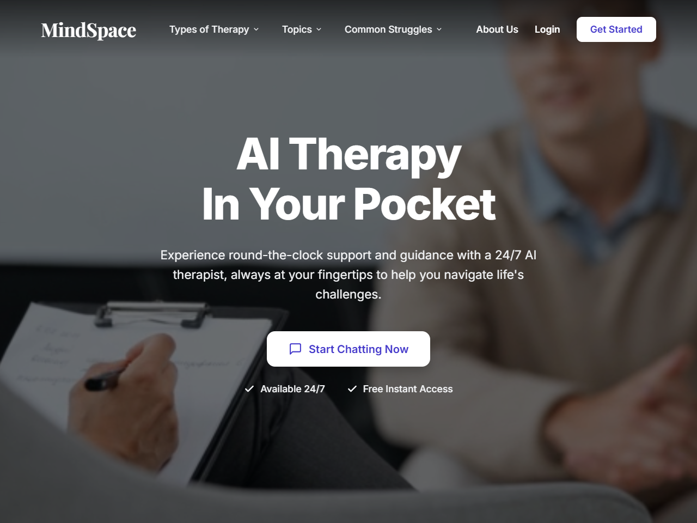
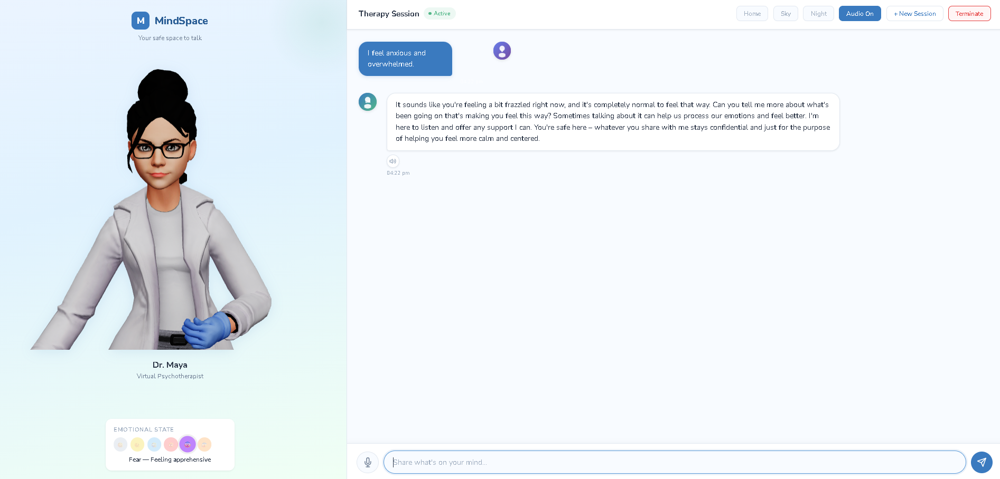

# MindSpace: Virtual Psychotherapist 🧠🤖

An offline-capable Virtual Psychotherapist application that provides a responsive, empathetic AI therapist (**Dr. Maya**). Users can interact via voice or text, and the system analyzes emotional states to generate therapeutic responses delivered through an animated avatar with synchronized text-to-speech.

## 📸 Screenshots

### Landing Page

*MindSpace AI Therapy in Your Pocket*

### Therapy Session

*Dr. Maya - Virtual Psychotherapist Chat Interface with Live Emotion Tracking*

---

## ✨ Core Features

- **Empathetic AI Conversationalist**: Powered by local LLM models (via Ollama) instructed with a specialized clinical therapist persona.
- **Multi-Layered Emotion Detection**: Analyzes text sentiment in real-time using VADER and HuggingFace Transformers (`distilroberta-base`) to identify Joy, Sadness, Anger, Fear, Anxiety, and Neutral states.
- **Dynamic Avatar Lip-Sync**: A fully animated SVG avatar (Dr. Maya) that dynamically syncs her mouth movements with generated speech via the Web Audio API.
- **Voice Interactions**: 
  - *Speech-To-Text (STT)*: Speak to the therapist using OpenAI's local Whisper models.
  - *Text-To-Speech (TTS)*: High-quality, empathetic cloud voices powered by Rekam.ai.
- **Crisis Detection System**: Built-in overrides to flag severe distress (e.g., self-harm keywords) and provide immediate emergency resources.
- **Offline Data Persistence**: All therapy sessions, conversation history, and emotion trends are securely saved locally via SQLite.

## 🛠️ Technology Stack

- **Backend**: Python 3.10+, Flask, SQLAlchemy
- **Frontend**: HTML5, CSS Variables, Vanilla JavaScript, Web Audio API
- **AI/ML**: Ollama, HuggingFace Transformers (`pipeline`), OpenAI Whisper
- **Data**: SQLite (via `database.py`)

## 🚀 Getting Started

### Prerequisites
1. Install [Ollama](https://ollama.com/) and run a local model (e.g., `qwen:0.5b` or `llama3`).
2. Python 3.10 or higher.
3. Git

### Installation

1. Clone the repository:
   ```bash
   git clone https://github.com/gauthamkt/Virtual-Psychotherapist.git
   cd Virtual-Psychotherapist
   ```

2. Create a virtual environment and install dependencies:
   ```bash
   python -m venv venv
   source venv/bin/activate  # On Windows: .\venv\Scripts\activate
   pip install -r requirements.txt
   ```

3. Download the emotion detection models (One-time setup):
   ```bash
   python setup_emotion_model.py
   ```

4. Run the application:
   ```bash
   python app.py
   ```

5. Open your browser and navigate to:
   [http://127.0.0.1:5000](http://127.0.0.1:5000)

## ⚠️ Disclaimer
MindSpace is an experimental AI application designed for educational and developmental purposes. It is **not** a replacement for professional medical advice, diagnosis, or therapy. If you are experiencing a crisis, please contact your local emergency services or a mental health professional immediately.
